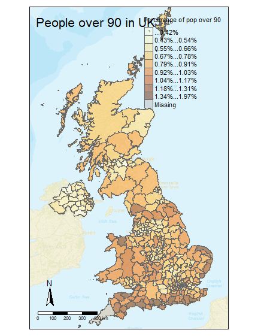
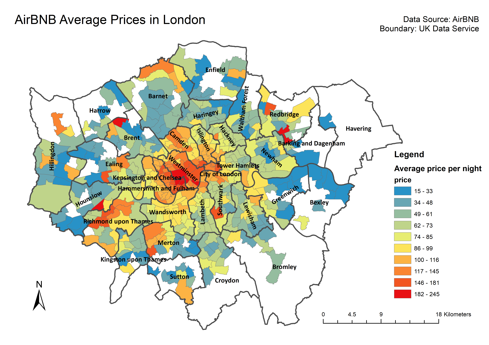

A comparison between GUI and command line generated maps

Graphical user interfaces and command lines composite two main choices of cartography. To illustrate the differences between these two types of software applied in drawing maps, this essay focuses on comparing mapping work flows and outcomes of ArcGIS, an GUI software, and R studio, a command-based application. Two maps are shown below.
```{r pressure, echo=FALSE, fig.cap="Fig 1"}

```
Data Source:Uk census
Boundary: UK Data Service


```{r pressure, echo=FALSE, fig.cap="Fig 2"}

```

Both maps are based boundary shapefiles provided by UK data service. Generated by codes in RStudio, fig 1 reveals a piece of census outcomes - the proportion of people who are 90 and over in total population in local authorities of the UK, which is also accessed through UK data service. After the accessibility of all data is ensured, the first step to plot in Rstudio is create a new project file. Through writing and running command lines in Rscript, attribute data of age distribution as well as boundaries data are read and examined, after which these two types of data are joined. With the aid of Thematic Map package, the percentage of population over 90 is shown and classified by colours in a map attached with the compass, the scale, the title and the legend. 
Meanwhile, fig 2 is processed in ArcMap with extra manipulation on raw data, as it illustrates more complex information - the average AirBNB prices (provided by AirBNB) in London wards. Instead of a spread sheet of attribute data and geographic codes, the data of every property proving AirBNB accommodation service in London is annotated with geographic coordinates. To spatialize this piece of data, the “make XY event layer” tool is applied to convert csv file to a new layer of dots in a database, while a new layer of London wards boundaries is extract from the raw shapefile and saved into the same database. In the next step tool “spatial join” is adapted, which calculates the average price of accommodations of every ward and add outcomes to attribute table of polygons. Finally, the map with colours showing the levels of prices of every spatial unit is adjusted and added with similar necessary elements in the layout view.
According to two maps and the work flows unfolded above, the cartographer concludes that RStudio and ArcGIS have similarities in terms of progresses and mapping outcomes. Both plotting progress follow a same basic order: 1.examining and amending raw data; 2.joining attribute data and geometric data; 3.visualising quantity deviations by color (in this case). Moreover, two maps convey equal amount of information through a same presentation. 
However, the differences between GUI based and command-line based mapping software mainly appear in the methods to manage and manipulate data and the ways to adjust layouts of maps. R is a programming language featuring in processing and analyzing data, and that is why checking and fixing raw spread sheet, or, in programming context, so called “dataframe” is more convenient than doing this in ArcGIS. Meanwhile, the way applied by ArcGIS to manage data is based on “layers”, so geodatabases and datasets of ArcGIS is suitable for managing spatial features with attributes. 
Another major difference exists in the progress of adjusting maps and layouts. In GUI software like ArcGIS, the colours representing attributes, classification of continuous features and the results of visualisation are reflected in interfaces. Moreover, the changes can be simultaneously show after every adjustment operation. The directness of operating is a great advantage of GUI software compared to command-based ones, especially in the domain of spatial data science. Besides, the way to arrange map layouts is much more flexible in ArcGIS, as users can accordingly insert any elements to any position while the layout choices are limited in RStudio based on commands and position descriptions.
